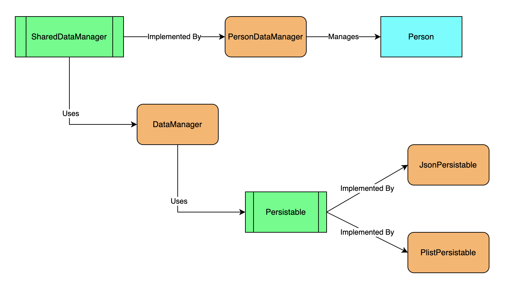

## DataManager

DataManager is meant to be my attempt at creating a generics based set of protocols and classes that allow you to use an entity class/struct that you have created and store data in a json or plist file.  I am always open to suggestions on how I can improve it.

## Problem Statement

Need to be able to read and write to either json or plist files.  Want to be able to easily swap between file type.  Would like the code to be reusable so I do not have to write a lot of boilerplate code to store entities in json or plist files.

Swift Protocols used:
    1. Codable
    2. Identifiable
    3. Hashable
    
Swift built in classes used:
    1. JSONDecoder
    2. JSONEncoder
    3. JSONSerialization
    4. PropertyListSerialization
    5. PropertyListEncoder
    6. Bundle
    7. FileManager
    

    

